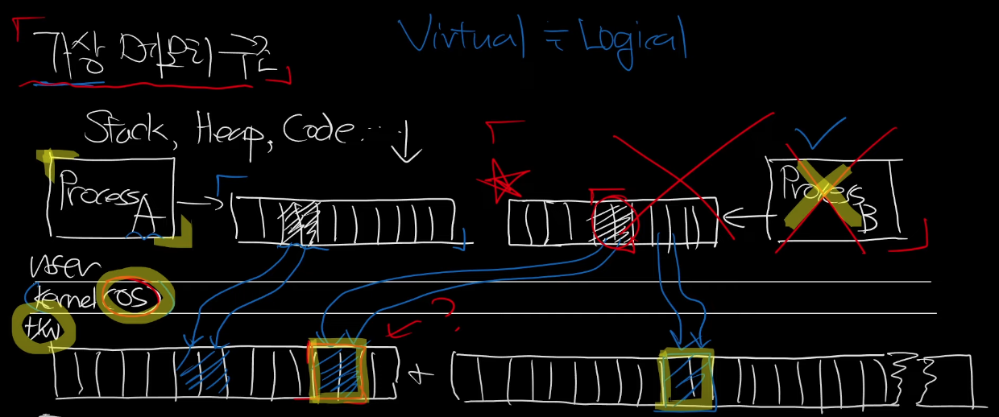

# 가상 메모리

## 가상 메모리는 왜 만들어졌나?

과거(윈도우 초창기) 에는 OS 와 일반 어플리케이션이 같은 레벨에서 실행되었다. 

부팅시 RAM의 일부분을 OS 에 할당하고 남은 부분을 프로세스가 점유하여 사용하였다.

이 과정에서 프로세스가 비정상적으로 종료되거나, Lock의 이유로 RAM을 점유한 채로 죽으면 프로세스가 점유중이던 메모리를 사용할수도 없었고, OS가 이를 비우고 다른 메모리에 할당할 수도 없었다. 즉, 프로그램 하나의 비정상적인 종료가 컴퓨터 시스템 전체에 영향을 주었고 해결방법은 재부팅하여 RAM을 싹 비우는 것 뿐이었다.

이러한 이유로 프로그램을 물리메모리에 직접 적재하고, 프로세스 하나에 너무 많은 권한을 부여하여 RAM에 직접 접근하는 것을 방지하여 운영체제의 안정적인 동작을 할 필요가 있었다. 그래서 운영체제에 더 큰 권한을 부여하고, 커널이라는 구조로 작동하며 다른 프로세스에 가상메모리를 할당하여 관리하는 효율적인 방법을 택했다.

[출처](https://www.youtube.com/watch?v=dPoNLIPo3_8)

## 가상 메모리의 구조

- RAM : 1차메모리 (빠르고, 작고, 비쌈)

- HDD : 2차 메모리 (비교적 느리고, 크고, 쌈)

- stack, heap, code가 각 프로세스의 가상메모리에 들어있다.
- 프로세스가 실행될때 운영체제는 각 프로세스에게 독립적인 가상 메모리 공간을 할당한다. 
- 프로세스는 가상메모리에 데이터들을 연속적으로 저장한다. 가상메모리에서는 연속적으로 저장되더라도, 물리메모리에는 연속적이지 않게, 빈 공간 어느곳에 매핑 되어 있을 수 있다. 
- 

- 그리고 프로세스가 종료되면, 가상메모리는 소멸되고 OS는 프로세스의 메모리 점유 상태를 알고 있으므로 프로세스가 사용중이던 메모리를 비운다. 실제로 메모리를 완전히 비우지 않더라도, 다른 프로세스가 접근 가능한 상태로 만들어 덮어쓸 수 있게 한다.

## 가상 메모리 활용

- 페이지(보통 4kb) 단위로 메모리를 나누어 사용한다.
- 페이지 아웃(page out, Swap out) : RAM에 올라가 있던 프로세스의 메모리 역역을 HDD등 2차 메모리로 옮기는 것.
  - Disk IO라서 느림

- 페이지 인: 위랑 반대.
- 페이지 인/아웃이 일어날 때마 실제 데이터의 위치는 바뀌지만 프로세스의 가상 메모리 입장에서는 달라진 게 없고 운영체제만 물리메모리가 어딘지만 알면 된다. 어차피 물리 메모리에 직접 접근 할 수 없기 때문

[출처](https://www.youtube.com/watch?v=rhH_-WffWQA)

## 가상메모리와 IPC

- 프로세스의 가상 메모리는 독립적이고, 타 프로세스의 동작과는 무관해야 한다.
- 하지만 프로세스의 가상 메모리 중에서 일부분을 공유할 수 있다. 운영체제의 관리 하에 둘 이상의 프로세스의 가상메모리가 같은 물리 메모리 영역을 가리키고 있는 것
- A 프로세스의 가상메모리 공유 공간에 변경이 일어나면, B 프로세스가 이벤트를 감지 하여 읽을 수 있다.
- 이에 가장 흔한 예시가 복붙이다. 프로세스간에 데이터를 주고 받게 된다.

[출처](https://www.youtube.com/watch?v=yWUGdttpgkc)